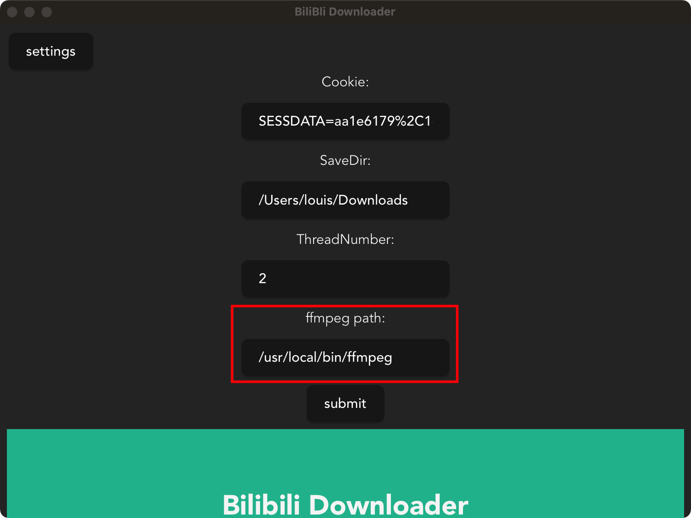
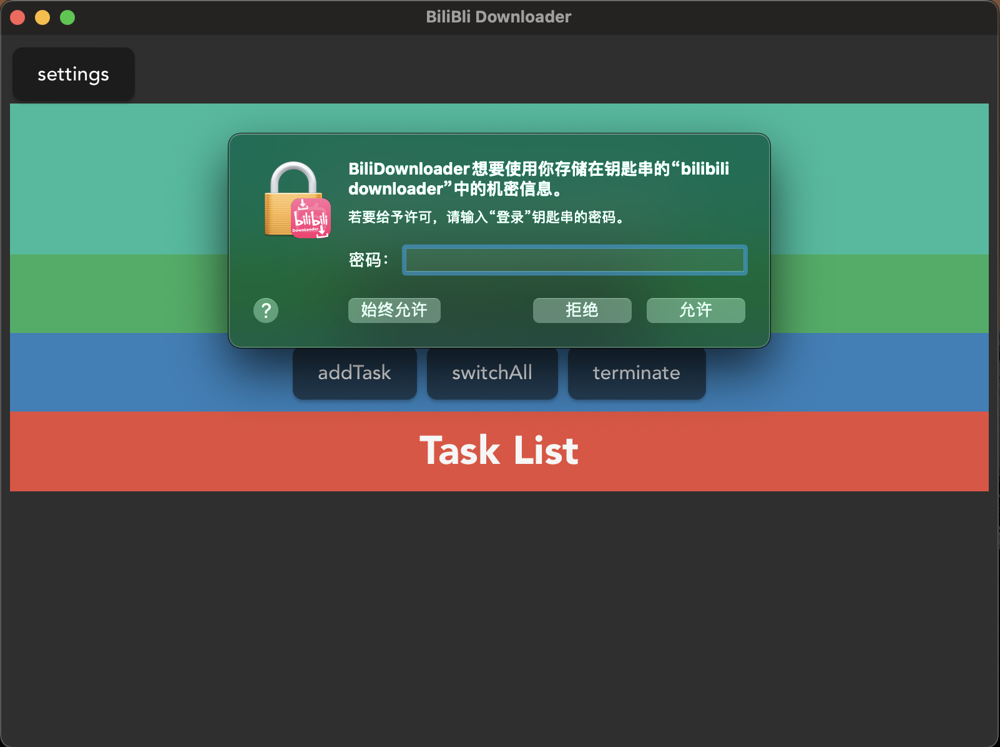
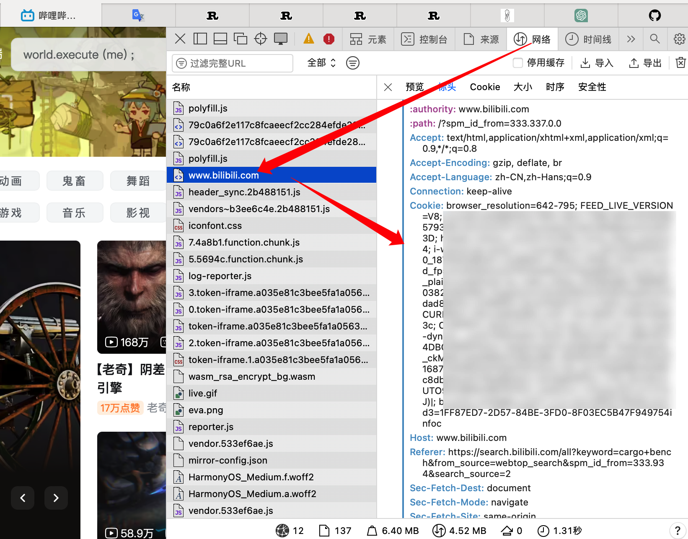
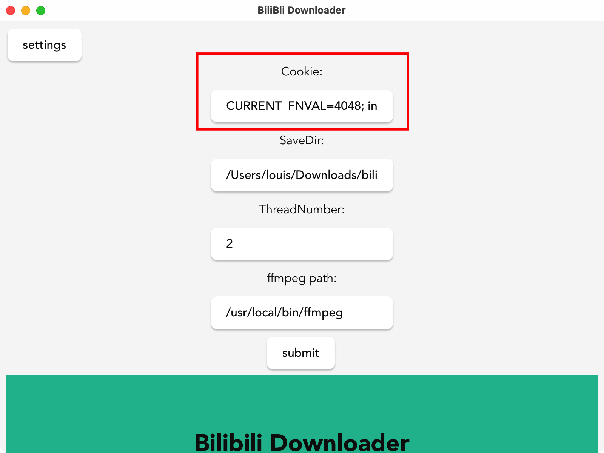

[![Contributors][contributors-shield]][contributors-url]
[![Forks][forks-shield]][forks-url]
[![Stargazers][stars-shield]][stars-url]
[![Issues][issues-shield]][issues-url]
[![MIT License][license-shield]][license-url]


<!-- PROJECT LOGO -->
<br />

<div align="center"  name="readme-top">
  <a href="https://github.com/kingwingfly/bilibili-downloader-rs">
    
  </a>

  <h3 align="center">Bilibili Downloader</h3>

  <p align="center">
    A bilibili video downloader app built by Tauri, Vue and Rust!
    <br />
    <a href="https://github.com/kingwingfly/bilibili-downloader-rs"><strong>Explore the docs »</strong></a>
    <br />
    <br />
    <a href="https://github.com/kingwingfly/bilibili-downloader-rs">View Demo</a>
    ·
    <a href="https://github.com/kingwingfly/bilibili-downloader-rs/issues">Report Bug</a>
    ·
    <a href="https://github.com/kingwingfly/bilibili-downloader-rs/issues">Request Feature</a>
  </p>
</div>


<!-- TABLE OF CONTENTS -->

<details>
  <summary>Table of Contents</summary>
  <ol>
    <li>
      <a href="#about-the-project">About The Project</a>
      <ul>
        <li><a href="#built-with">Built With</a></li>
      </ul>
    </li>
    <li>
      <a href="#getting-started">Getting Started</a>
      <ul>
        <li><a href="#prerequisites">Prerequisites</a></li>
        <li><a href="#compile">Compile</a></li>
      </ul>
    </li>
    <li><a href="#usage">Usage</a></li>
    <li><a href="#roadmap">Roadmap</a></li>
    <li><a href="#contributing">Contributing</a></li>
<!--     <li><a href="#license">License</a></li> -->
    <li><a href="#contact">Contact</a></li>
    <li><a href="#acknowledgments">Acknowledgments</a></li>
  </ol>
</details>


<!-- ABOUT THE PROJECT -->
## About The Project

[![Product Name Screen Shot][product-screenshot]](https://github.com/kingwingfly/bilibili-downloader-rs/)

[![Product Architecture][architecture]](https://github.com/kingwingfly/bilibili-downloader-rs/)

This is a Downloader for bilibili built by Tauri and Rust.

<iframe src="//player.bilibili.com/player.html?aid=953038969&bvid=BV1Ts4y1w7Yd&cid=1114294158&page=1" scrolling="no" border="0" frameborder="no" framespacing="0" allowfullscreen="true" height="480px"> </iframe>

## Important

### ffmpeg

You need `ffmpeg` to  merge the video and audio downloaded. Official download is [here](https://ffmpeg.org/download.html).

.

So, for MacOS, you need use brew to install ffmpeg, or just download one and put it into `/usr/local/bin`. Then you need use `which ffmpeg` to get the detailed path of it, and paste it in the app's setting, or you can't invoke the `ffmpeg` in released tauri app. (The chat-GPT says Unix can not get `path` in release version)

Moreover, due to the apple developer is expensive, so I can not provide an arch version. But the x64 version in release page can still be used, just remember opening it by right clicking the app icon and select open for the first time. And you should also permit your Mac allowing unknown source app in the system setting. 

For Windows, downloading the `ffmpeg` and adding it to path are enough. Recommend this [portable version](https://github.com/gniuk/cross-compile-ffmpeg-for-windows). Official version is also Ok certainly.

You could also specify a path to `ffmpeg` as you like in settings.


### An important new feature: Key Chain

For protecting your account security, from v0.0.4 on, I'll use the system key manager to protect your bilibili cookie. This is implemented by a rust crate called `keyring`.

For example, it will use `key chain` (AKA `钥匙串访问.app` in Chinese macOS system) to manage the bilibili downloader's config including cookie. That will be much safer if you don't allow other apps to visit it.



Don't be worry as you can see the system having told you bili downloader only ask for one key with a name called `bili downloader` which will be created by the app itself later. Getting `Always allow` option chosen will be greatly convinient for you.

What's less important, you should ensure your system has `Environment variable` named `USERNAME`. However, almost all system has it. If not, the app will just panic. Check it by `echo $USERNAME` in Linux or Unix like system or `Get-ChildItem Env: | findstr USERNAME` in powershell of Windows as you like for it's usually unnecessary.

If you don't like the app and decide to uninstall it, just deleting the key named `bilibili downloader` in `key chain` in macOS is OK. Other system I'm sorry I don't known.

And if the cookie is too long, it will also panic. All you need is just the `ESSADATA` line of the cookie. ([where to find cookie](#Usage))


By the way, many apps like vscode or adobe save the key info through the same way.

Last, I don't know how Windows protect the cookie. That's strange the system didn't ask permission when I test the app on Windows. 

## Advantages

Here are advantages:
* Simultaneous downloads: This downloader can potentially download multiple videos at once, making it a faster and more efficient tool for users.
* Reduced storage space: A smaller-sized image downloader can potentially take up less space on the user's device, which is especially beneficial for devices with limited storage capacity.

<p align="right">(<a href="#readme-top">back to top</a>)</p>


### Built With

* [![Rust][RustLogo]][Rust-url]
* [![Tauri][TauriLogo]][Tauri-url]
* [![Tokio][TokioLogo]][Tokio-url]
* [![Vue][Vue.js]][Vue-url]

<p align="right">(<a href="#readme-top">back to top</a>)</p>


<!-- GETTING STARTED -->
## Getting Started

You can compile by yourself, or just got release [here](https://github.com/kingwingfly/bilibili-downloader-rs/releases).

### Prerequisites

You need rust, tauri-cli, npm first. 
* npm
  ```sh
  npm install npm@latest -g
  ```
* tauri
  ```sh
  cargo install create-tauri-app
  ```

And maybe you need this [Tauri Quick Start](https://tauri.app/v1/guides/getting-started/setup) for further infomation. 

### Compile

1. Clone the repo
   ```sh
   git clone https://github.com/kingwingfly/bilibili-downloader-rs.git
   cd bilibili-downloader-rs
   ```
2. Install NPM packages
   ```sh
   npm install
   ```
3. start compile
   ```sh
   cargo tauri build
   ```

<p align="right">(<a href="#readme-top">back to top</a>)</p>


<!-- USAGE EXAMPLES -->
## Usage

Maybe you can get cookie through your browser.





<p align="right">(<a href="#readme-top">back to top</a>)</p>


<!-- ROADMAP -->
## Roadmap

- [x] Keep config
- [x] Fix bug: fast switch before the real download beginning will lead range downloads out of sync
- [x] The real pause of resp.chunk()
- [ ] Lazily check restart
- [ ] Performance optimize
- [x] Encrypt cookie
- [ ] Limit the download speed in default
- [ ] Remind user to like, coin and collection
- [ ] File name check

See the [open issues](https://github.com/kingwingfly/bilibili-downloader-rs/issues) for a full list of proposed features (and known issues).

<p align="right">(<a href="#readme-top">back to top</a>)</p>


<!-- CONTRIBUTING -->
## Contributing

Contributions are what make the open source community such an amazing place to learn, inspire, and create. Any contributions you make are **greatly appreciated**.

If you have a suggestion that would make this better, please fork the repo and create a pull request. You can also simply open an issue with the tag "enhancement".
Don't forget to give the project a star! Thanks again!

1. Fork the Project
2. Create your Feature Branch (`git checkout -b feature/AmazingFeature`)
3. Commit your Changes (`git commit -m 'Add some AmazingFeature'`)
4. Push to the Branch (`git push origin feature/AmazingFeature`)
5. Open a Pull Request

<p align="right">(<a href="#readme-top">back to top</a>)</p>


<!-- LICENSE -->
<!-- ## License

Distributed under the MIT License. See `LICENSE.txt` for more information.

<p align="right">(<a href="#readme-top">back to top</a>)</p> -->


<!-- CONTACT -->
## Contact

Louis - [@email](20200581@cqu.edu.cn) - 20200581@cqu.edu.cn

Project Link: [https://github.com/kingwingfly/bilibili-downloader-rs](https://github.com/kingwingfly/bilibili-downloader-rs)

<p align="right">(<a href="#readme-top">back to top</a>)</p>


<!-- ACKNOWLEDGMENTS -->
## Acknowledgments

Some document may help in developing tauri app and crawler.

* [Tauri Example](https://github.com/tauri-apps/tauri/tree/dev/examples)
* [Tokio Quick Tutorial](https://tokio.rs/tokio/tutorial)
* [Rust Reqwest](https://crates.io/crates/reqwest)
* [Vue Document](https://router.vuejs.org/zh/guide/)

<p align="right">(<a href="#readme-top">back to top</a>)</p>


<!-- MARKDOWN LINKS & IMAGES -->
<!-- https://www.markdownguide.org/basic-syntax/#reference-style-links -->
[contributors-shield]: https://img.shields.io/github/contributors/kingwingfly/bilibili-downloader-rs.svg?style=for-the-badge
[contributors-url]: https://github.com/kingwingfly/bilibili-downloader-rs/graphs/contributors
[forks-shield]: https://img.shields.io/github/forks/kingwingfly/bilibili-downloader-rs.svg?style=for-the-badge
[forks-url]: https://github.com/kingwingfly/bilibili-downloader-rs/network/members
[stars-shield]: https://img.shields.io/github/stars/kingwingfly/bilibili-downloader-rs.svg?style=for-the-badge
[stars-url]: https://github.com/kingwingfly/bilibili-downloader-rs/stargazers
[issues-shield]: https://img.shields.io/github/issues/kingwingfly/bilibili-downloader-rs.svg?style=for-the-badge
[issues-url]: https://github.com/kingwingfly/bilibili-downloader-rs/issues
[license-shield]: https://img.shields.io/github/license/kingwingfly/bilibili-downloader-rs.svg?style=for-the-badge
[license-url]: https://github.com/kingwingfly/bilibili-downloader-rs/blob/master/LICENSE.txt
[linkedin-shield]: https://img.shields.io/badge/-LinkedIn-black.svg?style=for-the-badge&logo=linkedin&colorB=555
[linkedin-url]: https://linkedin.com/in/othneildrew
[product-screenshot]: static/screenshot.png
[architecture]: static/architecture.png
[RustLogo]: https://www.rust-lang.org/static/images/rust-logo-blk.svg
[Rust-url]: https://github.com/rust-lang/rust
[TauriLogo]: https://github.com/tauri-apps/tauri/blob/dev/.github/splash.png?raw=true
[Tauri-url]:https://github.com/tauri-apps/tauri
[TokioLogo]: https://img.shields.io/badge/Rust-Tokio-orange
[Tokio-url]: https://tokio.rs
[Vue.js]: https://img.shields.io/badge/Vue.js-35495E?style=for-the-badge&logo=vuedotjs&logoColor=4FC08D
[Vue-url]: https://vuejs.org/
****
